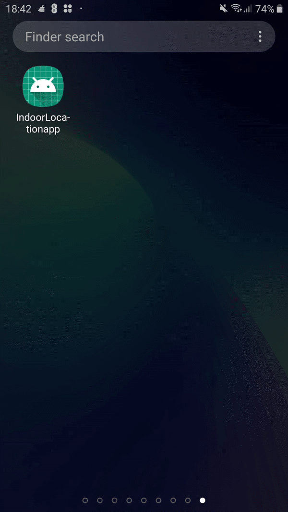

# Honour-Project
Indoor Location App using the Trilateration method with Wi-Fi Access points.

# Gradle
```
apply plugin: 'com.android.application'

android {
    compileSdkVersion 29
    buildToolsVersion "29.0.1"
    defaultConfig {
        applicationId "com.example.indoorlocationapp"
        minSdkVersion 15
        targetSdkVersion 29
        versionCode 1
        versionName "1.0"
        testInstrumentationRunner "androidx.test.runner.AndroidJUnitRunner"
    }
    buildTypes {
        release {
            minifyEnabled false
            proguardFiles getDefaultProguardFile('proguard-android-optimize.txt'), 'proguard-rules.pro'
        }
    }
}

dependencies {
    implementation fileTree(dir: 'libs', include: ['*.jar'])
    implementation 'androidx.appcompat:appcompat:1.1.0'
    implementation 'androidx.constraintlayout:constraintlayout:1.1.3'
    implementation 'com.google.android.material:material:1.0.0'
    implementation 'com.google.android.gms:play-services-maps:16.1.0'
    testImplementation 'junit:junit:4.12'
    androidTestImplementation 'androidx.test:runner:1.2.0'
    androidTestImplementation 'androidx.test.espresso:espresso-core:3.2.0'
    implementation 'pub.devrel:easypermissions:2.0.1'

}

```

# Notes
The app was created to locate a user without the app gathering user data to prevent privacy issues, This was done by showing the user what data was extracted (Wi-fi Access points and signal strength of these access points) and sending Mac address of the Wi-FI Access points to a Web APi to get Geo-Cordinates which allowed the trilateration method to locate the user. 

The goal of this app was to locate the user location indoor using Wi-Fi signals and display it through a floor map (depending what altitude the person was depended on which floor was displayed) and to send a screenshot via SMS or other messenging software. 

Currently the app can give a rough location on google maps using Wi-Fi Signals and has an Floor Map(GCU campus was used for testing but COVID19 prevented further testing) appended on google maps as shown in the demo. 

# Application Architecture
```
IDE: Android Studio
API: Google Maps API
Programming Language: Java

```
# Demo App


